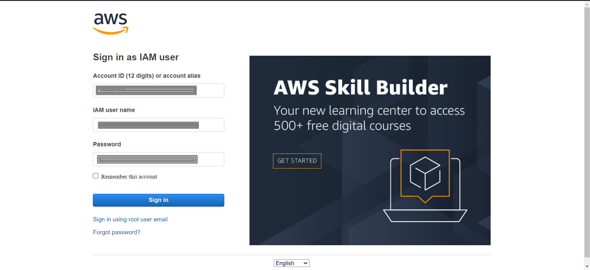
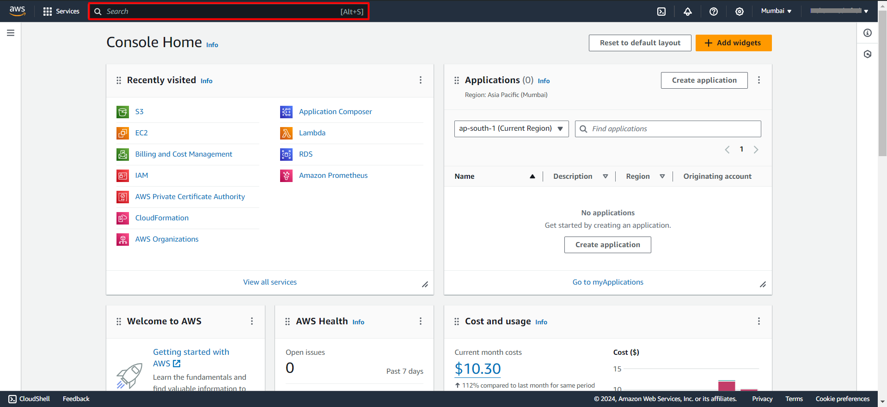
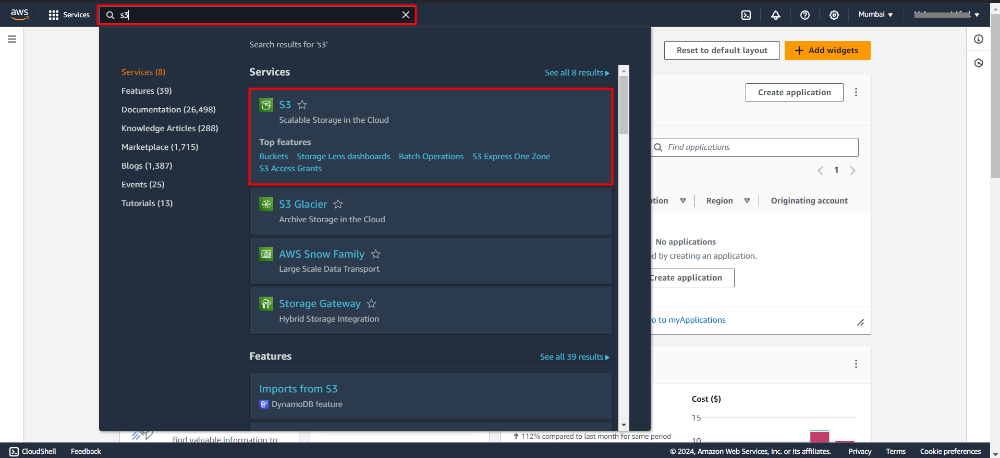
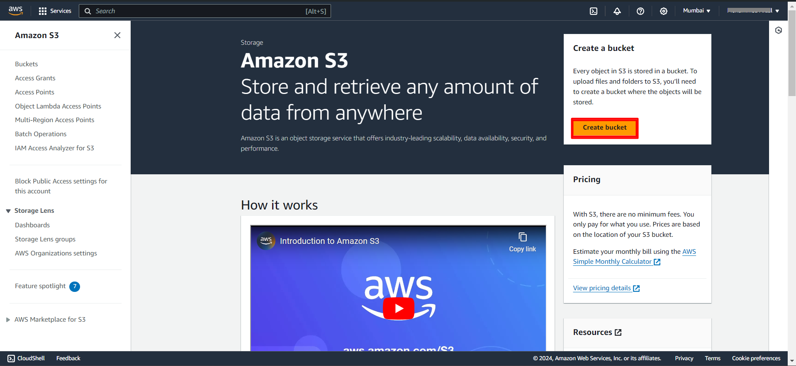
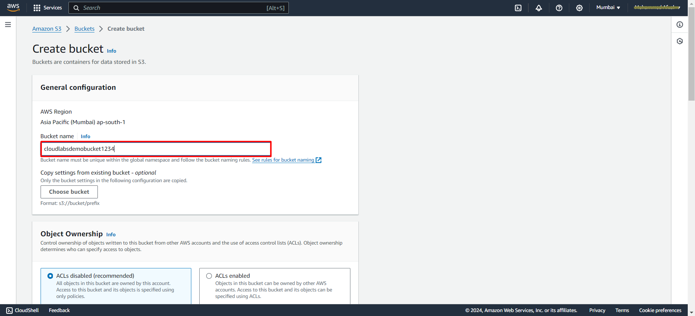
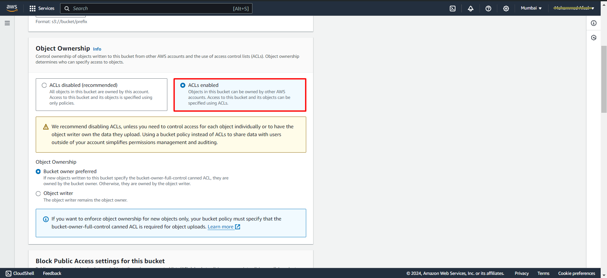
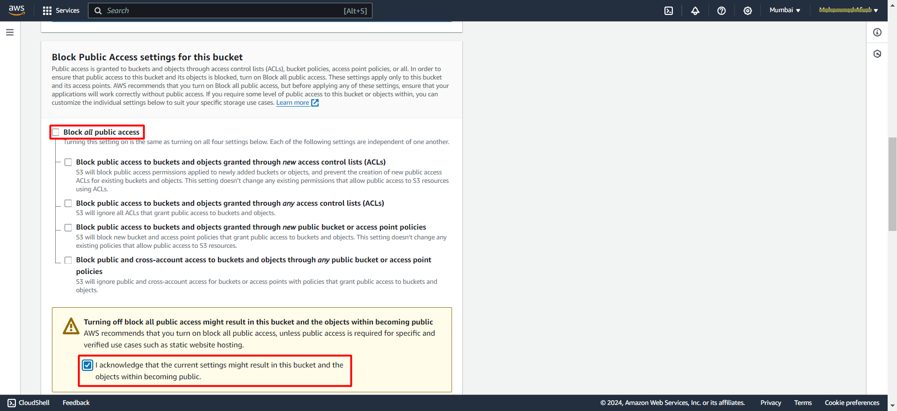
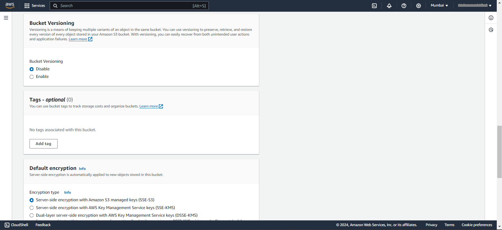
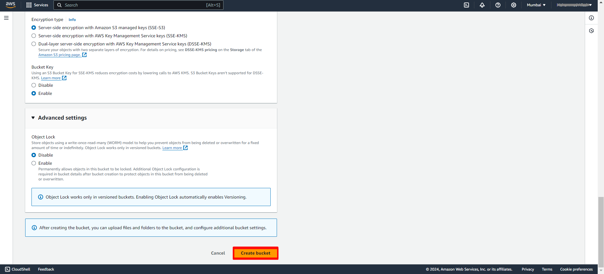

# Exercise 1: Creating Your First S3 Bucket
In this lab, you will learn how to create your first S3 bucket. Follow the step-by-step instructions below to create the bucket, and then explore best practices for bucket naming and configuration, as well as understanding bucket properties and settings.
#### Task 1: Sign in to the AWS Management Console 
1. Open browser of your choice and open the [AWS Management Console](https://signin.aws.amazon.com)
2. Sign in using your AWS account credentials.

---
#### Task 2. Navigating to the Amazon S3 Service
Once you are logged into the **AWS Management Console**, you can easily navigate to the **Amazon S3** service:

1. **Find Amazon S3 in the Services Menu:** At the top-left corner of the AWS Management Console, you will see a **search bar** Click on it. 

&nbsp;
2. Now Type **"S3"** into the search bar and press **Enter.**

&nbsp;
This will open the Amazon S3 dashboard, where you can view and manage your S3 buckets and objects.
---
#### Task 3: Creating Your First S3 Bucket.
1. In the Amazon S3 dashboard, click on the **"Create bucket"** button.

&nbsp;
2. Enter a **unique name** for your bucket. Bucket names must be globally unique across all of AWS, so choose a name that is unlikely to be already in use.

**Note: Bucket names must adhere to certain rules, Check the [Naming rules](https://website-name.com) for more info.**
&nbsp;
3. Make the Object Ownership as **ACL enabled** which helps in specifing the Access to this bucket and its objects using ACLs. 

&nbsp;
4. Uncheck the **Block all public access** option and check mark the acknowledgment below 

##### Understanding Bucket Properties and Settings:

- **Versioning:** Enables versioning for objects stored in the bucket, allowing you to preserve, retrieve, and restore every version of every object.
- **Server Access Logging:** Configures the bucket to log all requests made to it, providing visibility into who is accessing your data.
- **Tags:** Allows you to assign metadata to your bucket for organizational purposes, such as tracking cost allocation or implementing access controls.

5. Leave the **Bucket Versioning** settings Default, **tags** are optional you can give them for better managment.

&nbsp;
6. Leave all the reamining things Default and scroll down and click on **Create Bucket** Button

---
**Congratulations!** You have successfully created your first **S3 bucket** and explored best practices for naming and configuring buckets, as well as understanding bucket properties and settings. You can now proceed to the next lab to upload objects to your bucket.