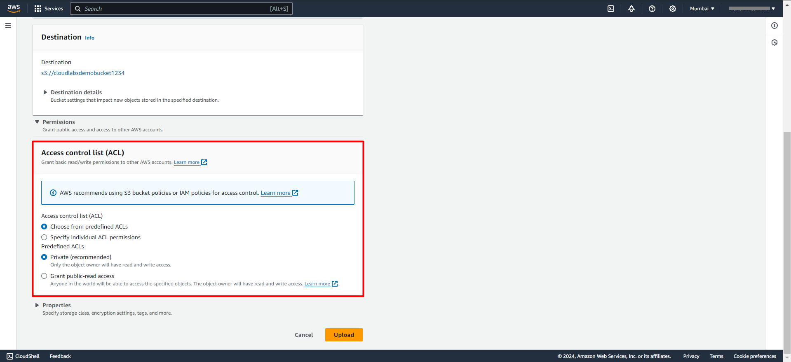

# Exercise 2: Uploading Objects to Your S3 Bucket.
In this Exercise, you will learn how to upload objects to your S3 bucket using the AWS Management Console. Additionally, you will explore different object storage classes available in Amazon S3.

#### Task 1. Using the AWS Management Console to Upload Files:
##### 1. Navigate to Your S3 Bucket:
- Once you are done creating a Bucket you'll be automatically redirected to the s3 home page where you can see list of all your bucket in current account across **all regions**.
- Click on the name of the **bucket** you created in the **previous lab** to open it.  

 

##### 2. Uploading Objects to the Bucket:
- In the bucket dashboard, click on the **"Upload"** button.

 
- Click on the **"Add files"** button to select the files you want to upload from your local machine.

 
- Choose the object you want to upload into the bucket and click on **"open"**

 
- Optionally, you can set permissions for the uploaded objects, such as making them public or restricting access to specific AWS accounts.

 
- Review the list of files you are uploading to ensure they are correct.
- Click on the **"Upload"** button to start the upload process.

- Once the upload is complete, you will see a **confirmation message** indicating that the files have been **successfully uploaded** to your S3 bucket.

 

#### Task 2: Exploring Different Object Storage Classes:
Amazon S3 offers several storage classes designed to optimize cost and performance based on the access patterns and retention requirements of your data. Here are some of the most commonly used storage classes:

- **Standard Storage:** Provides high durability, availability, and performance for frequently accessed data.
- **Standard-IA (Infrequent Access):** Offers the same durability and availability as standard storage but at a lower cost for infrequently accessed data.
- **One Zone-IA:** Similar to Standard-IA but stores data in a single Availability Zone, reducing costs further.
- **Intelligent-Tiering:** Automatically moves objects between different storage tiers based on access patterns, optimizing costs without sacrificing performance.
- **Glacier and Glacier Deep Archive:** Designed for long-term archival storage at a very low cost, with retrieval times ranging from minutes to hours.

##### To explore different storage classes:
- In the S3 bucket dashboard, select one or more objects that you uploaded in the previous step.
- Click on the **"Actions"** dropdown menu and select **"Edit storage class."**

 
- Choose the desired **storage class** from the dropdown menu. 
You can experiment with different storage classes to understand their characteristics and costs.
###### NOTE: learn more about the [ storage classes and their pricing](https://aws.amazon.com/s3/storage-classes/) by clicking on the link

- Click on the **"Save changes"** button to apply the changes to the selected objects.

**Congratulations!** You have successfully uploaded objects to your S3 bucket using the AWS Management Console and explored different object storage classes available in Amazon S3. 

You can now proceed to the **next lab** to learn about **managing objects** in your S3 bucket