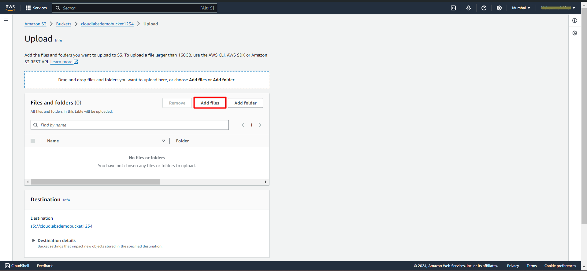

# Exercise 2: Uploading Objects to Your S3 Bucket.
In this Exercise, you will learn how to upload objects to your S3 bucket using the AWS Management Console. Additionally, you will explore different object storage classes available in Amazon S3.

#### Task 1. Using the AWS Management Console to Upload Files:
##### 1. Navigate to Your S3 Bucket:
- Once you are done creating a Bucket you'll be automatically redirected to the s3 home page where you can see list of all your bucket in current account across **all regions**.
- Click on the name of the **bucket** you created in the **previous lab** to open it.  

 

##### 2. Uploading Objects to the Bucket:
- In the bucket dashboard, click on the **"Upload"** button.

 
- Click on the **"Add files"** button to select the files you want to upload from your local machine.

 
- Choose the object you want to upload into the bucket and click on **"open"**

 
- Optionally, you can set permissions for the uploaded objects, such as making them public or restricting access to specific AWS accounts.

 
- Review the list of files you are uploading to ensure they are correct.
- Click on the **"Upload"** button to start the upload process.

- Once the upload is complete, you will see a **confirmation message** indicating that the files have been **successfully uploaded** to your S3 bucket.

 

**Congratulations!** You have successfully uploaded objects to your S3 bucket using the AWS Management Console 
